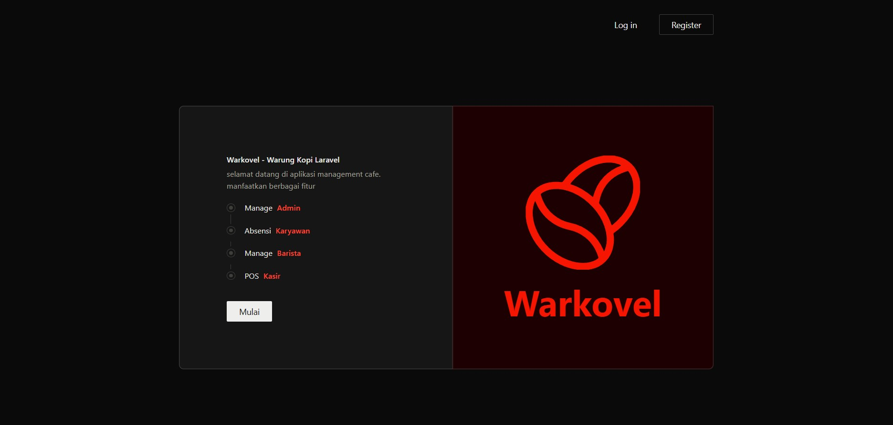
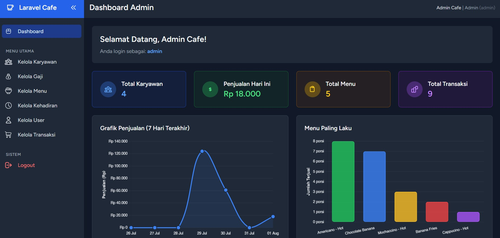
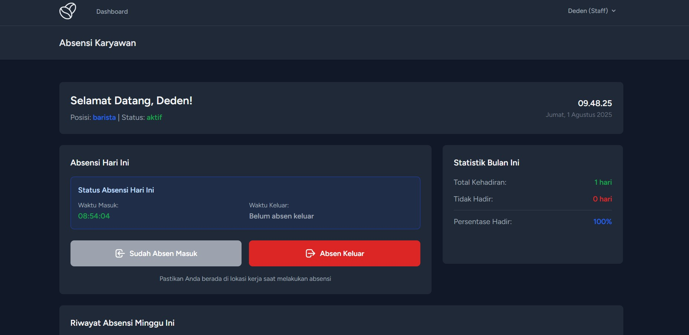
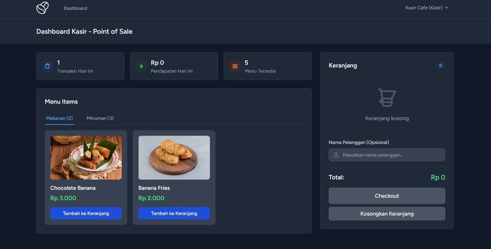
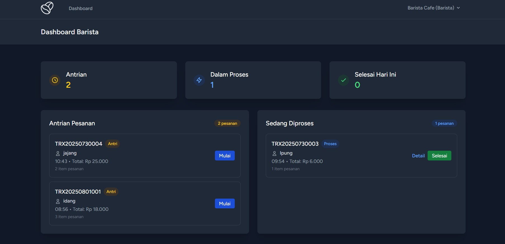

# Sistem Manajemen Cafe Laravel









---

## <svg width="25" height="25" viewBox="0 0 24 24" fill="none" xmlns="http://www.w3.org/2000/svg"><path d="M12 2C6.48 2 2 6.48 2 12s4.48 10 10 10 10-4.48 10-10S17.52 2 12 2zm-2 15l-5-5 1.41-1.41L10 14.17l7.59-7.59L19 8l-9 9z" fill="currentColor"/></svg> Akun Uji Coba

#### Admin
-   **Username**: `admin@cafe.com`
-   **Password**: `password`

#### Staff
-   **Username**: `deden@cafe.com`
-   **Password**: `deden123`

#### Kasir
-   **Username**: `kasir@cafe.com`
-   **Password**: `kasir123`

#### Barista

-   **Username**: `barista@cafe.com`
-   **Password**: `barista123`

## <svg width="25" height="25" viewBox="0 0 24 24" fill="none" xmlns="http://www.w3.org/2000/svg"><path d="M12 2L13.09 8.26L22 9L13.09 9.74L12 16L10.91 9.74L2 9L10.91 8.26L12 2Z" fill="currentColor"/></svg> Unimplemented feature

-   Fungsi lupa password
-   Integrasi payment gateway
-   ...

## <svg width="25" height="25" viewBox="0 0 24 24" fill="none" xmlns="http://www.w3.org/2000/svg"><path d="M5 13.18v4L12 21l7-3.82v-4L12 17l-7-3.82zM12 3L1 9l11 6 9-4.91V17h2V9L12 3z" fill="currentColor"/></svg> Pengembangan

#### Prasyarat

-   PHP 8.1+
-   Node.js 16+
-   Composer

#### Instalasi

1. Clone repository

```bash
git clone <repository-url>
cd laravel-cafe
```

2. Install dependensi

```bash
composer install
npm install
```

3. Atur environment

```bash
cp .env.example .env
php artisan key:generate
```

4. Jalankan migrasi dan seeder

```bash
php artisan migrate:fresh --seed
```

5. Jalankan server pengembangan

```bash
npm run dev
php artisan serve
```
